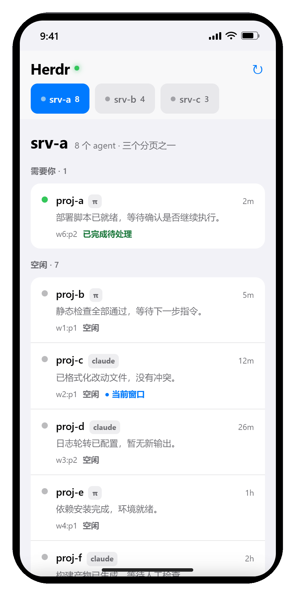

# herdr-hub

**零 npm 依赖的单文件服务：把多台服务器上的 herdr agent 会话，聚合成一个手机可用的 Web 界面。**

> **English summary:** a single-file, zero-dependency Node.js service that aggregates herdr agent sessions (pi / codex) scattered across multiple servers into one token-protected, phone-friendly web UI — open a URL, see who needs you, tap once to unblock.

## 解决什么问题

场景（虚构但典型）：你有三台 GPU 服务器 `srv-a` / `srv-b` / `srv-c`，上面并行跑着十几个 herdr 里的对话 agent。它们干着干着会**停下来等你确认**——等一个 `y`、等一个回车才能继续。而你人不在电脑前：

- 手机上 SSH + tmux 几乎不可用：软键盘按不出 vim 键、网络一抖就断、80 列文本滚到绝望；
- 等你回到桌前才发现，好几个 agent 已经干等了半小时。

herdr-hub 的答案就一句话：**打开一个 URL → 看谁需要你 → 点一下放行。**

## 演示（12 镜 · 33 秒 · 虚构数据）

<p align="center">
  
</p>

> 图中的服务器名 / 项目名 / 路径 / 对话全部是编造的演示数据，已过隐私自查（逐帧目视转录，禁词 `residual={}`、verdict `PASS`，证据见 `_demo/video/privacy_check.txt`，该文件不随仓库发布）。

## 功能清单

- **三台服务器分页——聚合，但分开**：所有机器聚在一个 URL 里，但顶部标签页**每台独立一屏，绝不混在一起**，左右滑动切换。列表按 `需要你 / 工作中 / 空闲` 分组，每行显示状态点、仓库名、agent 类型和它最后说了什么（预览）。
- **对话详情（聊天视图，不是终端）**：你的提问在右侧气泡；agent 回复渲染正文（代码块、表格、链接）；**转写**、**工具调用**收成一张卡（收起时一行 `› bash find …`，点开看输入输出）、**思考过程**默认折叠。
- **⌨ 键盘面板一键放行**：`esc / ↑ / ↓ / tab / y / n / 1 / 2 / Ctrl-C`，直接送进那个 agent 的终端——agent 停着等 `y`/回车时，手机上点一下就继续。
- **🔊 朗读**：详情页右上角用系统语音合成把最后一条回复念出来（念前先洗掉 markdown，代码块不会被念出来），再点停止。浏览器自带 `speechSynthesis`，零后端。
- **⋯ 会话管理**：重新选择会话记录（重选）、查看会话文件路径、重新载入对话（重载）；右上 `▤` 还能在「对话 / 原始终端屏幕」间切换。
- **🎤 语音输入**：录一段话填进输入框——**只填入、绝不自动发送**。
- **令牌鉴权**：所有页面与接口都必须带 `?t=<令牌>`，缺省一律 401。

## 架构要点

1. **每台服务器各自调用它自己的 herdr CLI（over SSH）**。hub 不内置任何 herdr 协议，只是 SSH 进每台机器、敲**那台机器自己的** herdr 命令（远端命令一律走 argv 数组 + POSIX 单引号转义拼装）。因此**不同 proto 版本可以共存、互不协商**——hub 从不和它们"谈协议"，实测 proto 16 与 19 两代混跑毫无冲突。
2. **读写分离**：读 = 解析会话文件渲染成聊天气泡；写 = 发进 pane。解析失败不影响你发消息。
3. **转写解析**：pi 与 codex 的会话文件格式不同（pi 给路径 `agent_session.kind="path"`，codex 给 id `kind="id"` → 对应 `rollout-*.jsonl`），且文件可能很大（codex 单个能到 20MB+），所以只 `tail` 尾部、绝不整读。
4. **同 cwd 多 agent 时返回 `ambiguous` + 候选让你选，绝不猜**：herdr 报不出确切路径时，hub 列出候选让你认领一次并记住（`pane-bindings.json`），而不是挑一个显示错的对话——**宁可说分不清，也绝不显示另一个 agent 的对话**。
5. **零 npm 依赖 = 单文件 `hub.mjs`**：只用 Node 内置模块，`npm install` 不存在这回事；图标是运行时用 zlib 手搓的 PNG。
6. **健壮性**：服务器之间完全隔离（一台挂了只影响它那一页，15 秒退避）；只有拿到确切结论才写缓存（一次 SSH 抖动不会被记成"这台机器没有会话"）；会话文件路径做严格白名单校验（安全字符、必须 `.jsonl` 结尾、必须落在允许的 sessions 目录下）。

## 快速开始

```bash
git clone <repo>
cp servers.example.json servers.json          # 填你自己的服务器
cp hub.config.example.json hub.config.json    # 可选：语音服务地址
echo "<自定义令牌>" > token.txt
node hub.mjs                                  # 或双击 启动.cmd
```

浏览器打开 `http://<host>:8787/?t=<令牌>`（首次打开后令牌存进浏览器，之后不用再敲）。

手机：和 hub 同一内网 / Tailscale 网内直接访问；Safari「分享 → 添加到主屏幕」，之后是全屏的、跟原生 App 一样。

> `pane-bindings.example.json` 是参考样例，通常不需要手动建——认领发生时前端会自动写 `pane-bindings.json`。

## 配置说明

### `servers.json`（必填，参考 `servers.example.json`）

| 字段 | 含义 |
|---|---|
| `id` | 短名，用于面板分页和 `pane-bindings` 的 key（如 `srv-a`） |
| `label` | 界面上显示的名字 |
| `host` | SSH 目标（可直接用 `~/.ssh/config` 里的 Host 别名） |
| `bin` | **该机器上 herdr 可执行文件的绝对路径**——非交互式 SSH 的 PATH 通常不含 `~/.local/bin`，必须写绝对路径（踩过的坑） |

加服务器 = 加一行，不用改任何代码。

### `hub.config.json`（可选，语音识别，参考 `hub.config.example.json`）

| 字段 | 含义 |
|---|---|
| `asr.url` | 你本地语音模型的接口，例：`http://127.0.0.1:8123/v1/audio/transcriptions` |
| `asr.token` | 需要鉴权就填，否则留空 |
| `asr.language` | 如 `zh` |
| `asr.field` | 音频字段名，默认 `file` |
| `asr.model` | 模型名，可留空 |
| `asr.timeoutMs` | 超时，默认 60000 |

协议：hub 向 `asr.url` 发 `multipart/form-data`（`file` = 音频二进制 webm/m4a/wav，外加 `language`），你的服务返回 `{"text": "..."}` 即可——whisper.cpp server 的 `/inference` 和 OpenAI 兼容的 `/v1/audio/transcriptions` 都直接符合，**不用改代码**，填好刷新页面 🎤 就出现。

### `pane-bindings.json`（自动生成，参考 `pane-bindings.example.json`）

key = `<serverId>:<paneId>`，value = 该 agent 的会话文件绝对路径。只在"同目录并行多 agent、herdr 报不出路径、你手动认领"时写入。

### `token.txt`

一行自定义令牌，别提交进任何仓库（本仓已 gitignore）。

### 环境变量

`HUB_PORT`（默认 8787）、`HUB_BIND`（默认 0.0.0.0）、`HUB_TOKEN`（设为 `off` 关闭鉴权）、`HUB_TAIL_BYTES`（转写读取的尾部字节数）。

## 安全

- **令牌必带，缺省 401**：页面和所有 `/api/*` 都要求 `?t=` 或等价头。
- **建议只绑内网或 Tailscale，不要直接暴露公网**——这个 hub 拿着你所有服务器的 SSH 通路。
- `servers.json` / `token.txt` / `hub.config.json` / `pane-bindings.json` **已写进 `.gitignore`，不会上传**；仓库里只有虚构值的 `*.example.json`。
- **HTTPS**（iOS 上想拿麦克风权限，**必须 HTTPS**）——用 Tailscale 一条命令：

  ```bash
  tailscale serve --bg --https 443 http://127.0.0.1:8787
  ```

  之后手机走 `https://<你的机器名>.<你的 tailnet 域名>` 访问，证书由 Tailscale 自动签发。

## 已知限制（诚实版）

- **需要跑 hub 的这台机器在线**：hub 本质上是"本机 → 各服务器"的 SSH 桥，本机关机就用不了。想 24×7 可以挪到一台常开的机器上 `node hub.mjs`，无平台依赖。
- **状态靠 6 秒轮询，不是推送**（对话详情页 4 秒），打开列表后预览是后台小步补的，个别行要等十几秒。
- **语音输入当前硬编码直连 `127.0.0.1:8123`**：手机浏览器访问的是手机自己的回环地址，**直连不通**。hub 端已有 `/api/transcribe` 代理接口就位，前端改走它是一个明确的 TODO。
- **发送路径未经端到端实测**（不会为了测试往你正干活的 agent 里注入文本）；失败检测已验证，想检查命令构造可用 `POST /api/send` 带 `{"dry":true}`，它只回显将要执行的命令。
- 多行输入会被合并成单行发送（TUI 里裸换行等于"提交"）；hub 重启后「持续时长」清零，此时不显示而不是显示假的"刚刚"。

## License

MIT — 见 [LICENSE](LICENSE)。
